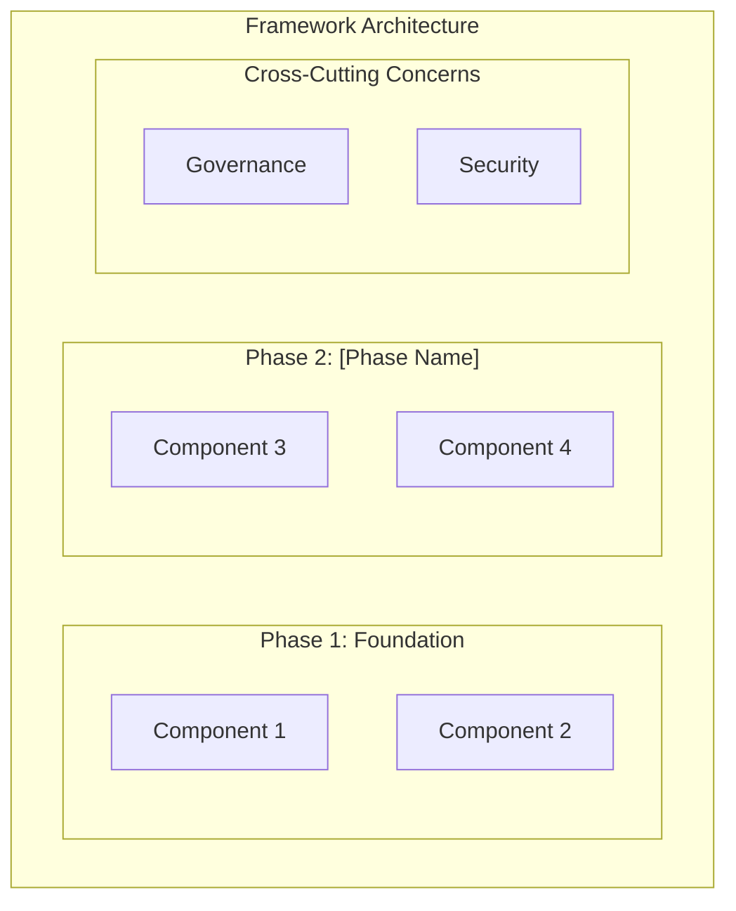

# Framework Overview: [PROJECT_NAME]

> **Template Origin**: Official | **ArcKit Version**: [VERSION] | **Command**:
> `/arckit:framework`

## Document Control

<!-- DOC-CONTROL-HEADER -->
<!-- Resolved at command-execution time to _partials/document-control-uk.md or _partials/document-control-uae.md based on plugin userConfig classification_scheme + governance_framework. See _partials/RENDERING.md (when present). -->

## Revision History

| Version   | Date   | Author    | Changes                                           | Approved By | Approval Date |
| --------- | ------ | --------- | ------------------------------------------------- | ----------- | ------------- |
| [VERSION] | [DATE] | ArcKit AI | Initial creation from `/arckit:framework` command | [PENDING]   | [PENDING]     |

---

## Executive Summary

### Vision

[1-2 paragraphs describing the overarching vision for this framework. What
transformation or capability does it enable? What future state does it support?]

### Challenge Being Addressed

[Description of the problem, gap, or challenge that this framework addresses.
Why is a structured framework needed? What are the consequences of not having
one?]

### Solution Approach

[Overview of how the framework addresses the challenge. What methodology,
structure, or approach does it take? How does it differ from previous efforts?]

### Scope

[Define the boundaries of the framework. What is in scope? What is explicitly
out of scope? Which teams, systems, or processes does it cover?]

- **In Scope**: [List of areas, teams, systems, or processes covered]
- **Out of Scope**: [List of areas explicitly excluded]
- **Dependencies**: [External frameworks, standards, or systems this framework
  depends on]

---

## Framework Architecture

### Dimensions and Axes

[Describe the primary dimensions or axes along which the framework is organised.
For example, a data framework might have dimensions of Data Governance, Data
Quality, Data Integration, and Data Analytics. A security framework might have
dimensions of Identify, Protect, Detect, Respond, and Recover.]

| Dimension     | Purpose                         | Key Outcomes        |
| ------------- | ------------------------------- | ------------------- |
| [Dimension 1] | [What this dimension addresses] | [Expected outcomes] |
| [Dimension 2] | [What this dimension addresses] | [Expected outcomes] |
| [Dimension 3] | [What this dimension addresses] | [Expected outcomes] |
| [Dimension 4] | [What this dimension addresses] | [Expected outcomes] |

### Layers

[Describe the layers of the framework, from strategic to operational.]

| Layer               | Description                                        | Audience                        |
| ------------------- | -------------------------------------------------- | ------------------------------- |
| [Strategic Layer]   | [High-level direction, principles, and governance] | [Senior leadership, architects] |
| [Tactical Layer]    | [Policies, standards, and patterns]                | [Managers, lead engineers]      |
| [Operational Layer] | [Procedures, tools, and implementation guides]     | [Delivery teams, practitioners] |

### Cross-Cutting Concerns

[Identify concerns that span all dimensions and layers of the framework.]

- **Governance**: [How governance applies across the framework]
- **Security**: [How security is embedded throughout]
- **Compliance**: [Regulatory and standards compliance approach]
- **Change Management**: [How changes to the framework are managed]

### Framework Architecture Diagram

---

## Design Philosophy

### Systems Thinking Foundations

This framework is shaped by four foundational systems thinking laws:

| Law                                     | Principle                                                                                                                              | How Applied                                                                                                                           |
| --------------------------------------- | -------------------------------------------------------------------------------------------------------------------------------------- | ------------------------------------------------------------------------------------------------------------------------------------- |
| **Ashby's Law of Requisite Variety**    | "Only variety can absorb variety" — a governance framework must have at least as much variety in its controls as the system it governs | [How the framework's control variety matches the system's complexity — see Requisite Variety Assessment below]                        |
| **Conant-Ashby Good Regulator Theorem** | "Every good regulator of a system must be a model of that system" — the framework must accurately represent the system it governs      | [How the framework models the actual system architecture, components, and relationships — verified via Document Map and Traceability] |
| **Gall's Law**                          | "A complex system that works is invariably found to have evolved from a simple system that worked" — start simple, layer on complexity | [How phased adoption ensures each phase is independently viable before building on it]                                                |
| **Conway's Law**                        | "Organizations produce designs that mirror their communication structures" — framework adoption must align with organisational reality | [How adoption paths and phase boundaries respect team structure and communication patterns]                                           |

### Key Design Decisions

[Describe the fundamental design decisions that shaped this framework. Why was
this structure chosen over alternatives? What trade-offs were made?]

| Decision     | Choice        | Rationale                  |
| ------------ | ------------- | -------------------------- |
| [Decision 1] | [Choice made] | [Why this choice was made] |
| [Decision 2] | [Choice made] | [Why this choice was made] |
| [Decision 3] | [Choice made] | [Why this choice was made] |

### Requisite Variety Assessment

> **Ashby's Law of Requisite Variety**: "Only variety can absorb variety." A
> governance framework must have at least as much variety in its controls,
> principles, and guidance as the system it governs.

The following table maps the project's identified concern domains against the
framework's governance controls:

| Domain                  | System Variety (Concerns Identified)              | Framework Controls (Artifacts / Governance) | Coverage                  |
| ----------------------- | ------------------------------------------------- | ------------------------------------------- | ------------------------- |
| [e.g., Security]        | [Concerns from requirements, stakeholders, risks] | [Artifacts addressing this domain]          | [COVERED / PARTIAL / GAP] |
| [e.g., Data Governance] | [Concerns from requirements, stakeholders, risks] | [Artifacts addressing this domain]          | [COVERED / PARTIAL / GAP] |
| [e.g., Compliance]      | [Concerns from requirements, stakeholders, risks] | [Artifacts addressing this domain]          | [COVERED / PARTIAL / GAP] |
| [e.g., Operations]      | [Concerns from requirements, stakeholders, risks] | [Artifacts addressing this domain]          | [COVERED / PARTIAL / GAP] |

**Coverage Summary**: [Statement on whether the framework has requisite variety.
Identify any domains where system variety exceeds framework control variety, and
recommend additional artifacts or governance mechanisms to close the gaps.]

### Good Regulator Check

> **Conant-Ashby Theorem**: "Every good regulator of a system must be a model of
> that system."

[Assessment of whether this framework faithfully models the system it governs.
Does the Document Map represent every significant system component? Are
relationships and dependencies between components reflected in the phase
structure? Identify any aspects of the system that are not represented in the
framework's governance structure.]

### Guiding Principles Alignment

| Principle                       | How Applied                                          | Framework Impact                         |
| ------------------------------- | ---------------------------------------------------- | ---------------------------------------- |
| [Principle 1 from ARC-000-PRIN] | [How this principle is applied within the framework] | [What impact it has on framework design] |
| [Principle 2 from ARC-000-PRIN] | [How this principle is applied within the framework] | [What impact it has on framework design] |
| [Principle 3 from ARC-000-PRIN] | [How this principle is applied within the framework] | [What impact it has on framework design] |
| [Principle 4 from ARC-000-PRIN] | [How this principle is applied within the framework] | [What impact it has on framework design] |

---

## Document Map

The following documents form the complete framework, organised by phase:

| Phase          | Document     | Doc Type                         | Description                             |
| -------------- | ------------ | -------------------------------- | --------------------------------------- |
| Foundation     | [Document 1] | [e.g., Principles, Policy]       | [Brief description of document purpose] |
| Foundation     | [Document 2] | [e.g., Standards, Guidelines]    | [Brief description of document purpose] |
| Definition     | [Document 3] | [e.g., Architecture, Data Model] | [Brief description of document purpose] |
| Definition     | [Document 4] | [e.g., Requirements, Patterns]   | [Brief description of document purpose] |
| Implementation | [Document 5] | [e.g., Procedures, Runbooks]     | [Brief description of document purpose] |
| Implementation | [Document 6] | [e.g., Templates, Checklists]    | [Brief description of document purpose] |
| Operations     | [Document 7] | [e.g., Monitoring, Review]       | [Brief description of document purpose] |
| Operations     | [Document 8] | [e.g., Metrics, Reporting]       | [Brief description of document purpose] |

---

## Standards Alignment

| Standard     | Version   | How Used                                     | URL   |
| ------------ | --------- | -------------------------------------------- | ----- |
| [Standard 1] | [Version] | [How this standard is applied or referenced] | [URL] |
| [Standard 2] | [Version] | [How this standard is applied or referenced] | [URL] |
| [Standard 3] | [Version] | [How this standard is applied or referenced] | [URL] |
| [Standard 4] | [Version] | [How this standard is applied or referenced] | [URL] |

---

## Adoption Guidance

### How to Adopt the Framework

[Describe the recommended approach for adopting this framework. Is it intended
for incremental adoption or full implementation? What is the minimum viable
adoption?]

### Entry Points by Role

| Role                       | Start With                   | Then         | Goal                                    |
| -------------------------- | ---------------------------- | ------------ | --------------------------------------- |
| [Executive / Sponsor]      | [First document or activity] | [Next steps] | [What success looks like for this role] |
| [Architect / Lead]         | [First document or activity] | [Next steps] | [What success looks like for this role] |
| [Developer / Practitioner] | [First document or activity] | [Next steps] | [What success looks like for this role] |
| [Operations / Support]     | [First document or activity] | [Next steps] | [What success looks like for this role] |
| [Governance / Compliance]  | [First document or activity] | [Next steps] | [What success looks like for this role] |

### Phased Adoption Approach

| Phase                   | Focus                       | Activities       | Duration    | Success Criteria      |
| ----------------------- | --------------------------- | ---------------- | ----------- | --------------------- |
| Phase 1: Awareness      | Understanding the framework | [Key activities] | [Timeframe] | [Measurable criteria] |
| Phase 2: Foundation     | Establishing core practices | [Key activities] | [Timeframe] | [Measurable criteria] |
| Phase 3: Implementation | Embedding into operations   | [Key activities] | [Timeframe] | [Measurable criteria] |
| Phase 4: Optimisation   | Continuous improvement      | [Key activities] | [Timeframe] | [Measurable criteria] |

---

## Traceability

### Source Documents

| Source Document         | Document ID            | Key Contributions                                     |
| ----------------------- | ---------------------- | ----------------------------------------------------- |
| Architecture Principles | ARC-000-PRIN-v[N].md   | Guiding principles, decision framework                |
| Stakeholder Analysis    | ARC-[PID]-STKE-v[N].md | Stakeholder needs, goals, communication plans         |
| Requirements            | ARC-[PID]-REQ-v[N].md  | Business, functional, and non-functional requirements |
| Risk Register           | ARC-[PID]-RISK-v[N].md | Risks, mitigations, and constraints                   |
| [Additional Source]     | [Document ID]          | [Key contributions to the framework]                  |

## External References

> This section provides traceability from generated content back to source
> documents. Follow citation instructions in the project's citation reference
> guide.

### Document Register

| Doc ID          | Filename | Type | Source Location | Description |
| --------------- | -------- | ---- | --------------- | ----------- |
| _None provided_ | —        | —    | —               | —           |

### Citations

| Citation ID | Doc ID | Page/Section | Category | Quoted Passage |
| ----------- | ------ | ------------ | -------- | -------------- |
| —           | —      | —            | —        | —              |

### Unreferenced Documents

| Filename | Source Location | Reason |
| -------- | --------------- | ------ |
| —        | —               | —      |

---

**Generated by**: ArcKit `/arckit:framework` command **Generated on**: [DATE]
**ArcKit Version**: [VERSION] **Project**: [PROJECT_NAME] **Model**: [AI_MODEL]
