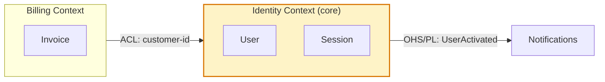
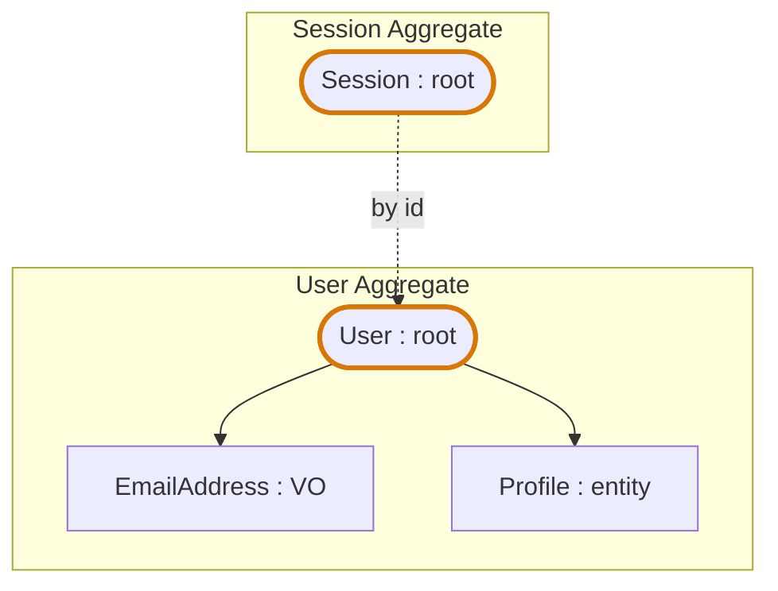

# Plan presentation: DDD diagram conventions

Optional companion to [plan-presentation.md](plan-presentation.md). **Diagrams
are OFF by default** in this codebase — read this file only when the
exception fires.

## When a diagram is allowed at all

Generate a DDD diagram only when **one** is true:

- The feature touches **3+ bounded contexts** (rare), or introduces a new
  integration pattern between contexts.
- The human explicitly requests a diagram.

Even in the first case, **ask first** — don't generate by default. End the
plan with one line: *"A context map could clarify this — generate one?"* and
wait. If after a few months the human has never said yes, the prose-only
workflow is confirmed; if they say yes often, promote to default for that
trigger.

Because the CLI doesn't render Mermaid, any diagram lives in an HTML artifact
([plan-html-artifacts.md](plan-html-artifacts.md)), never in terminal output.

## Why off by default

- The reader would have to learn the conventions (colours, shapes) per
  diagram type.
- Without rigid conventions the agent improvises styles each time.
- Mermaid renders only in the browser → context-switch out of the terminal,
  losing flow.
- In tactical DDD the model is largely **readable from the code itself**
  (roots by type, VOs by immutability, repositories by interface). Working in
  prose is a valid choice, not a gap.

## Minimum conventions (for the day you flip the switch)

Mermaid has no native DDD support (issue #1624 still "approved, contributor
needed" as of May 2026), so emulate via `flowchart` + `subgraph`.

### Context map

````

````

Conventions:

- `subgraph` = one bounded context; label says core / supporting / generic.
- Core context gets a fill colour.
- Edge labels carry the integration pattern: **OHS** Open Host Service,
  **ACL** Anti-Corruption Layer, **SK** Shared Kernel, **CF** Conformist,
  **PL** Published Language.

### Aggregate map

````

````

Conventions:

- Stadium shape `([...])` = aggregate root.
- Rectangle = entity or VO, labelled `: VO` / `: entity` / `: root`.
- Solid arrow = composition inside the aggregate.
- Dashed arrow = reference between aggregates — **always by id, never by
  object reference.**

Domain message-flow diagrams (`sequenceDiagram` with `[command]` / `[event]`
/ `[query]` labels) are possible too, but skip them here — this codebase is
tactical-without-strong-events.

## What NOT to do

- **Don't draw the project's full context map** — show only the subgraph of
  contexts this feature touches. Otherwise the diagram is about the system,
  not the plan.
- **Don't show entities inside an aggregate the feature doesn't touch** — the
  aggregate map shows the boundary + affected elements only.
- **Don't use UML notation** — in the DDD community it's associated with old
  rich class-diagram modelling that hides anemic models. Simple shapes with
  explicit labels are clearer.
- **Don't mirror the folder structure.** If the diagram looks like the
  directory tree it's noise — it must show *domain* relationships, not code
  organization.
